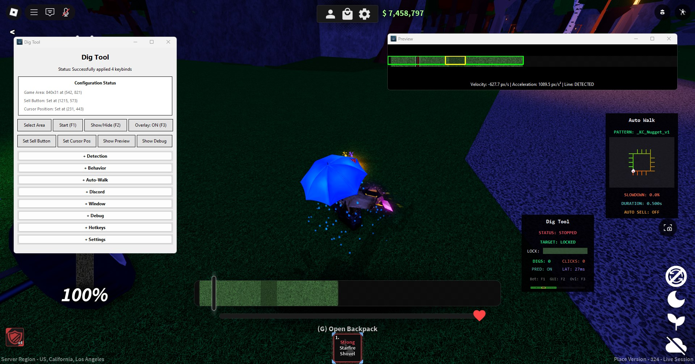
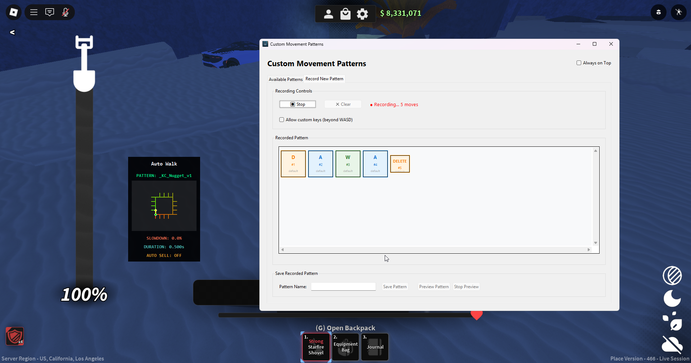
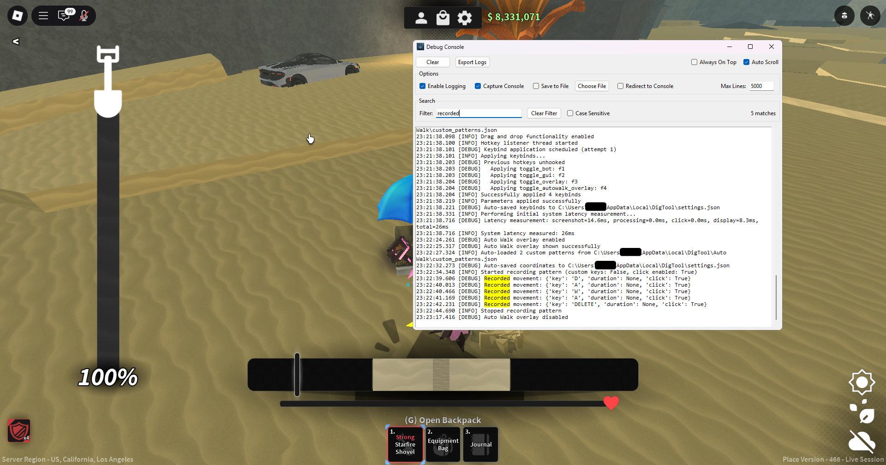

<!--

Dig Tool rules the world!

Always make sure you're running the correct software:

Github -> https://github.com/iamnotbobby/dig-tool
Discord -> https://discord.com/invite/mxE7dzXMGf

-->

> [!CAUTION]
> Only download Dig Tool from the **official** repository (https://github.com/iamnotbobby/dig-tool/releases). Never download from untrusted links.


### 🥄 Dig Tool

A highly configurable automation tool for ROBLOX ["Dig"](https://www.roblox.com/games/126244816328678) using advanced algorithms to achieve precision during the minigame.


👉 [Get started](docs/USAGE.md) or join the [Discord community](https://discord.com/invite/mxE7dzXMGf)!

made with ❤️

[](https://github.com/iamnotbobby/dig-tool/releases/latest)
[](https://github.com/iamnotbobby/dig-tool/releases/latest)
[](https://discord.com/invite/mxE7dzXMGf)

## ⭐ Features

Dig Tool was originally developed with the primary focus of achieving significant accuracy during the minigame. Since then, it has expanded to include several other features, such as:

* In-depth customization panel with detection settings and adjustable accuracy parameters.
* Full-fledged AFK mode (auto-walk) with a built-in walk pattern recorder, path visualizations, a reverse-engineered mathematical formula to determine the walk speed decrease given in-game after digging X items, and more.
* A lightweight OCR engine with no performance cost, integrated into Dig Tool to detect various in-game displays.
* Sleek Discord notification system with _live_ webhook updates.
* Several toggleable in-game HUD overlays that reflect real-time metrics.
* Support for external automation of Dig Tool by outputting information about Dig Tool's internal status (e.g., AHK).

and much more!

## 📷 Showcase





## 📦 Installation 

### 1. Quick Start (Recommended)
Download the compiled executable (.exe) from the [releases page](https://github.com/iamnotbobby/dig-tool/releases/latest) - no Python installation required.

The executable is generated by [GitHub Actions](https://github.com/iamnotbobby/dig-tool/actions) with build attestations for security.

> [!WARNING]
> Some antivirus programs may flag the compiled executable as malicious. These are FALSE POSITIVES. You have every right to be suspicious, and you also have the right to perform a thorough analysis of both the code and the executable provided.

### 2. Run from Source
```bash
git clone https://github.com/iamnotbobby/dig-tool
cd dig-tool
pip install -r requirements.txt
python main.py
```

Compile yourself: `python compile.py`

> [!NOTE]
> Option 1 is recommended for most users as it requires no technical setup. Choose Option 2 if you want to modify the source or prefer running from source.

## 📖 Documentation

[Usage](docs/USAGE.md) // [Settings](docs/SETTINGS.md) // [Technical overview](docs/TECHNICAL.md)

## 💭 Footnotes

Contributions are welcome! Part of this project wouldn't have existed without the contributions given.

For issues, questions, or community support you can join the [discord](https://discord.com/invite/mxE7dzXMGf).

This project is licensed under [MIT License](https://github.com/iamnotbobby/dig-tool/blob/beta/LICENSE).
